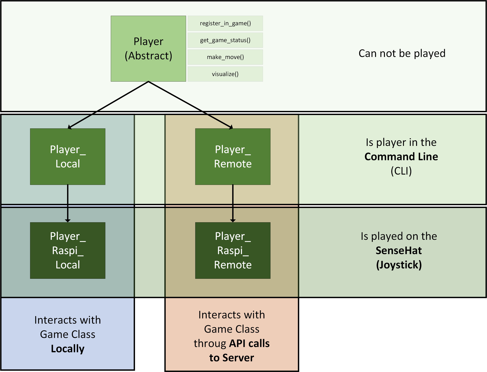
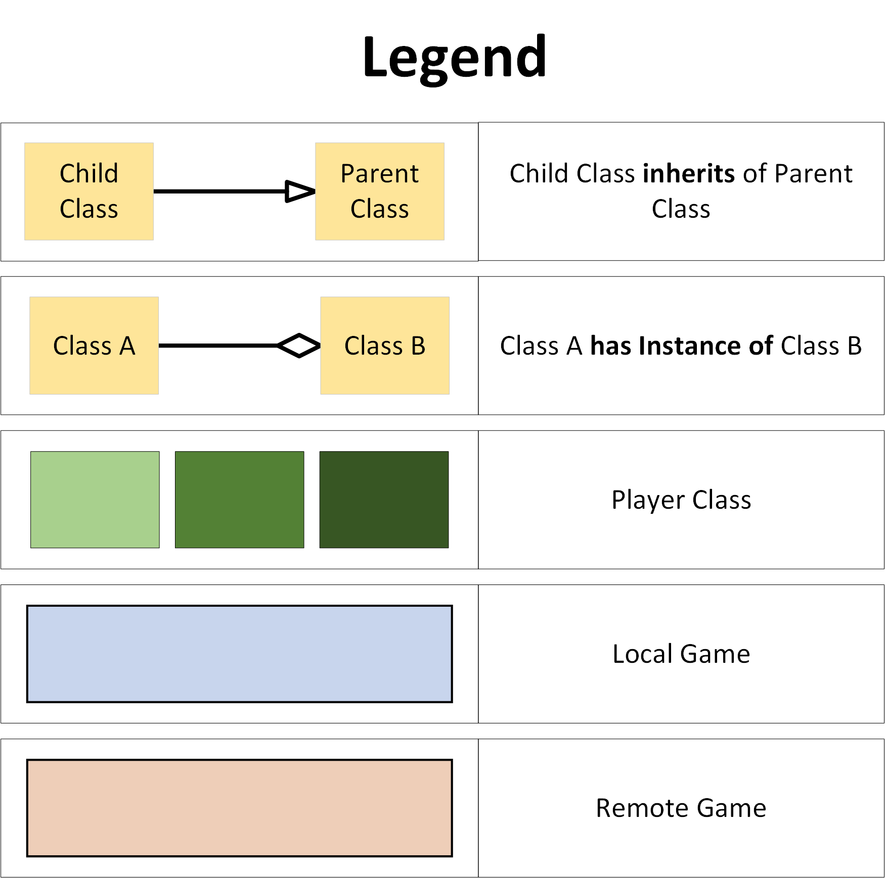
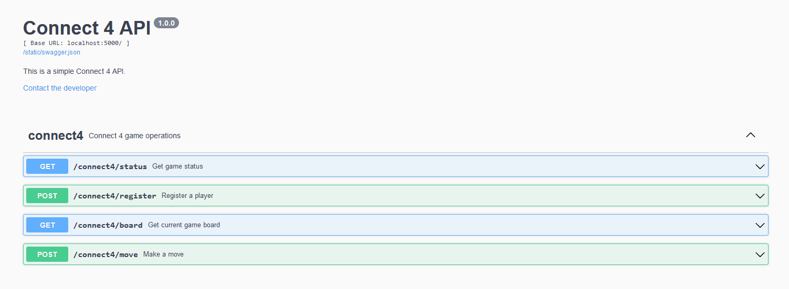
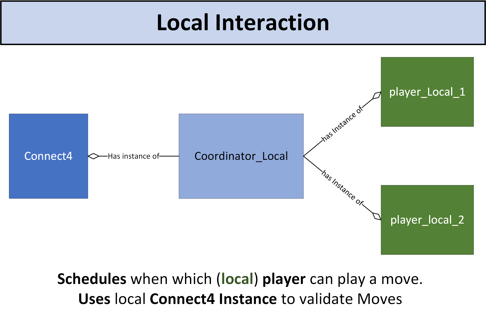
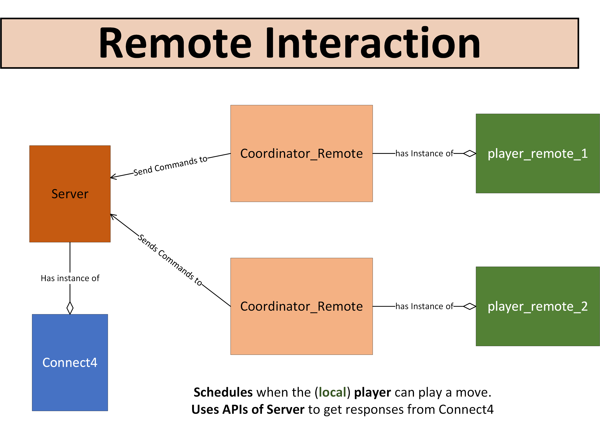
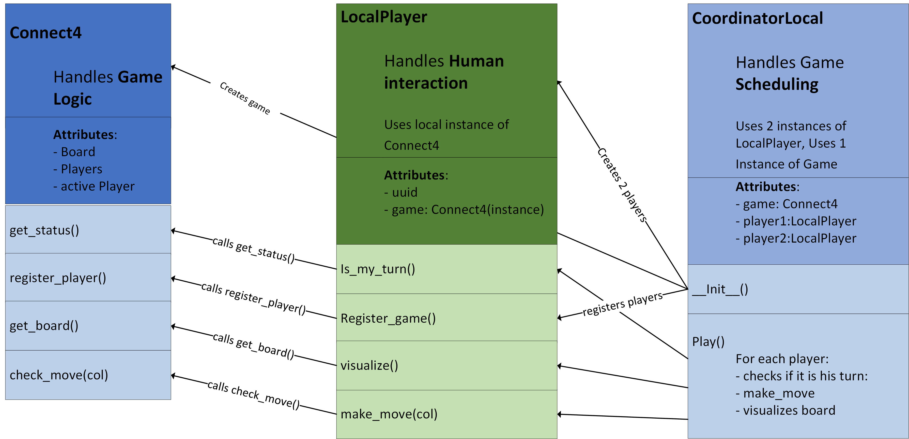

# Raspi Connect 4
Student Project from **Python Advanced**, HS24


- [Raspi Connect 4](#raspi-connect-4)
  - [Administrative Information](#administrative-information)
    - [RaspberryPi](#raspberrypi)
- [Complete Game Description](#complete-game-description)
  - [Game Architecture](#game-architecture)
    - [Local and Remote Game Variants](#local-and-remote-game-variants)
  - [Classes](#classes)
    - [Connect4 - Game](#connect4---game)
    - [Players](#players)
    - [Player Types](#player-types)
    - [Server](#server)
    - [Local Interactions](#local-interactions)
    - [Remote Interaction](#remote-interaction)
  - [Play the Game](#play-the-game)
    - [Local Game](#local-game)
    - [Remote Game](#remote-game)
- [Requirements](#requirements)
- [Local Game](#local-game-1)
  - [Architecture](#architecture)
- [Bug - Fixes:](#bug---fixes)
  - [Raspberry Pi](#raspberry-pi)


## Administrative Information
- Project as a semester performance (40%)
- Teams of two
- Game modes:
  - **Local** on the PC 
    - On the Raspberry Pi (``SenseHat``)
    - in the terminal (``CLI``)
  - **Remote**: Over the network via REST API and Flask web server 
    - On the Raspberry Pi (``SenseHat``)
    - in the terminal (``CLI``)
  - Implementation of a bot (competition at the end of the semester)
- Hand In: 
  - **Due Date: SW13 12.12.24**
  - Source Code
  - A 4-5 minute video about the project:
    - Overview
    - Difficulties / Highlights, etc.
    - Demo


### RaspberryPi
The raspberry pi will be collected **after the MEP**. If someone does not attend the MEP, please hand your RaspberryPi back in `SW14`.

**Failure to return the RaspberryPi will result in an `F`** in this module.


# Complete Game Description
The following chapter describes the **entire architecture and functionality of all "sub-steps"** of the Connect4 Game.
If you are just starting -> go to this section instead, where just the **local game mode** is described.

## Game Architecture
The **Connect 4 Game** can be played in **4 different ways**:
- locally (2 players) on `CLI`
- locally (2 players) on `SenseHat`
- remote (2x 1 player) on `CLI`
- remote (2x 1 player) on `SenseHat`

### Local and Remote Game Variants
The different game variants are based on the interaction between the **`Player`** classes and the **`Connect4`** game, with the key distinction being how the game coordination is handled:

- **Local Games**: The `Coordinator_Local` has access to two local players and the **`Connect4`** instance. Both players **interact directly with the game logic** (by having access to the same instance of `Connect4`), making moves and visualizing the board either in the `CLI` or on the `SenseHat`. **The entire game (2 players) runs on the same device.**

- **Remote Games**: The `Coordinator_Remote` controls one player, who communicates with the **`Connect4`** logic **via REST API endpoints** which expose the methods of a `Connect4` game. In this case, the **game logic runs on a server**, and **two players on two devices** interact with the game over the network by sending requests to the server.

These four game variant require four different player variants. They are:

<div style="text-align: center;">

</div>

<div style="text-align: center;">

</div>

## Classes
The game consists of the following main classes:

- **`Connect4`**: Contains the main game logic.
  - More details in [Connect4 Game](#connect4---game)
- **`Connect4Server`**: Exposes the methods from `Connect4` to remote players via API endpoints.
  - More details in [Server](#server)
- **`Player`**: Abstract class defining what a player should be able to do.
  - `Player_Local`: Uses methods from the locally available `Connect4` instance.
    - `Player_Raspi_Local`: Local player on a Raspberry Pi (using the `SenseHat`).
    - More details in [Local Player](#local-player)
  - `Player_Remote`: Uses **REST API endpoints** to interact with the `Connect4` game through the server.
    - `Player_Raspi_Remote`: Remote player on a Raspberry Pi (using the `SenseHat`).
    - More details in [Remote Player](#remote-player)

- **`Coordinator_Local`**: Coordinates **2 local players** (on the same device).
  - More details in [Local Interaction](#local-interactions)
- **`Coordinator_Remote`**: Coordinates **1 local player** (same device) with **1 remote player** (different device) by communicating with the `server`.
  - More details in [Remote Interaction](#remote-interaction)

### Connect4 - Game
This class contains the essential game logic:

- Defines the **game state** (`get_game_state()`):
  - **what** a legal move is
  - **when** a player wins (`winner`)
  - **whose** turn it is (`active_player`)
  - **which** turn it is (`turn_number`)

- Returns the current **board state** (`get_board()`): An `8x7 numpy array` containing:
  - `'X'` for one player
  - `'O'` for the other player
  - `''` for empty spots

- **Move validation** (`check_move()`): Checks whether a move is legal and updates the board accordingly.

- **Winner detection** (`detect_win()`): Detects if a player has four consecutive pieces in a row (horizontally, vertically, or diagonally).

### Players

The **`Player`** classes implement certain **abstract methods** to manage the gameplay flow, whether local or remote. The key methods include:

- **`make_move`**: Allows the player to select a column to drop a coin.
- **`visualize`**: Visualizes the current board state.
- **`register_in_game`**: Registers the player in the game.
- **`get_game_status`**: Retrieves the current game status.
- **`celebrate_win`**: Performs the player's winning celebration.

### Player Types
- **`CLI Player`**: Input is handled through the console, and the board state is also displayed in the console.
- **`SenseHat Player`**: Input is handled through the SenseHat joystick module, and the board state is displayed on the LED matrix of the SenseHat.

### Server
The **`Connect4Server`** exposes the game logic to remote players through four API endpoints:

1. **`/connect4/status`** (GET): Returns the current game status.
2. **`/connect4/register`** (POST): Registers a player in the game.
3. **`/connect4/board`** (GET): Returns the current board state.
4. **`/connect4/check_move`** (POST): Validates a move and updates the board if the move is legal.

These endpoints allow remote players to interact with the **`Connect4`** game instance running on the server. The API is documented using Swagger, available at:  
[http://127.0.0.1:5000/swagger/connect4/](http://127.0.0.1:5000/swagger/connect4/)



### Local Interactions
In a local game (2 players on the same device), the interaction between the classes is as follows:

<div style="text-align: center;">

</div>

**Note**: The players can either be controlled via the `CLI` or the `SenseHat`.

### Remote Interaction
In a remote game (2 players on different devices), the interaction between the classes is as follows:

<div style="text-align: center;">

</div>

**Note**: Here, the players can also be controlled either via the `CLI` or the `SenseHat`.

## Play the Game
Make sure you meet the [Requirements](#requirements), and then start either a [local](#local-game) or [remote](#remote-game) game:

### Local Game
1. Start the `local_coordinator.py` in a **terminal**.
   - This creates **2 local players**.
     - You can choose between `CLI` or `SenseHat` players (default is `CLI`).

### Remote Game
1. Start `server.py` in a **first terminal**.
   - Note the `IP address` of the server.
2. Start `remote_coordinator.py` in a **second terminal**.
   - Provide the `IP address` of the server as the target.
   - Play as **Player 1** on the `CLI` or the `SenseHat` (default is `CLI`).
3. Start `remote_coordinator.py` in a **third terminal**.
   - Provide the `IP address` of the server as the target.
   - Play as **Player 2** on the `CLI` or the `SenseHat` (default is `CLI`).

# Requirements
To fulfill all requirements to run this game, follow these steps:

1. Create a new `conda` or `venv` **environment** and **activate** it.
2. `cd` into this folder (where the `setup.py` file is).
3. Execute the following command:

```bash
pip install .
```

  This **installs all dependencies** listed in `setup.py`.

4. Play the game in any of the [available versions](#game-architecture).


# Local Game
This section only describes the **first substep** of implementing the ``Connect4`` Game.
Namely how you can create a **local ``Connect4`` Game**, playable on the CommandLine (``CLI``)


## Architecture
The architecture of the local game is as follows:


<div style="text-align: center;">

</div>

  - `Coordinator_Local`: Handles scheduling of the game
    - Has **instance** of `Connect4`
    - Has **2 instances** of `PlayerLocal`
    - tells players when what to do 
      - by calling their methods
  
  - `PlayerLocal`: Handles Human Interaction
    - Has **instance of `Connect4`** (given by `Coordinator_Local`)
    - Allows a Human to:
      - Enter a move (via `CLI`)
      - See the Board (via `CLI`)
        - calls `get_board()` from `Connect4` for this
  
  - `Connec4`: Handles Game Logic
    - knows which players (by `uuid`) are playing
      - set with `register_player()`
    - knows `game_state`
      - who's players turn it is
      - if there is a winner
      - gives out this information with `get_game_state()`
    - knows what a legal move is:
      - uses this information in `check_move(col,player)`
    - can check/make a move from player:
      - checks first if move is legal
      - if so: updates the `game_state`


# Bug - Fixes:

## Raspberry Pi
The Raspberry Pi requires a quick **fix** to allow files to be moved, changed, etc.

1. Navigate to the folder `home/pi`.
2. **Change the permissions** of the `student` folder (and all sub-folders) using the following command:

```bash
sudo chmod -R 777 student
```

This ensures that you have the necessary permissions to move and modify files on the Raspberry Pi.